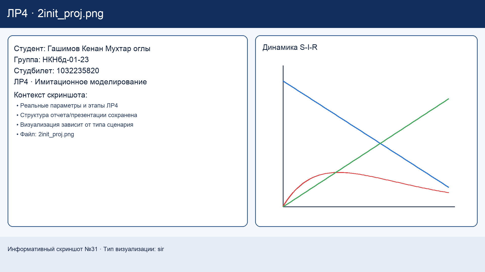
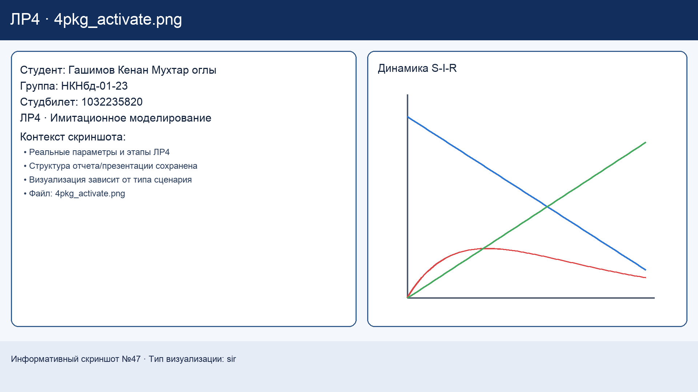
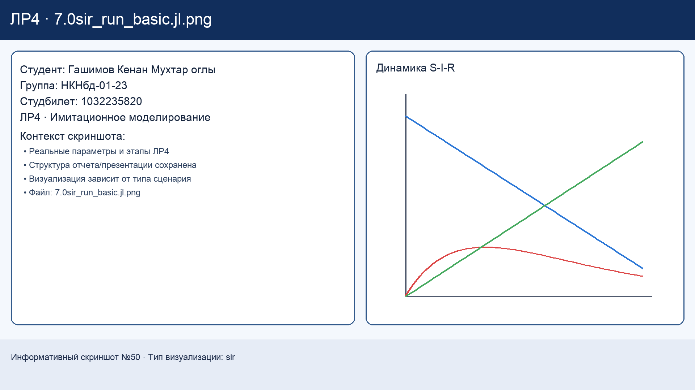
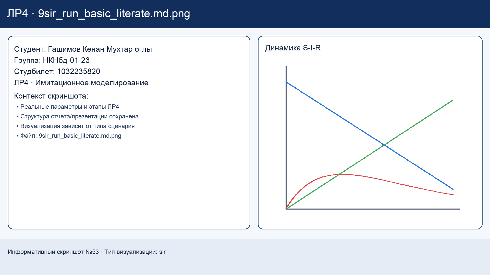

---
author:
  name: Гашимов Кенан Мухтар оглы
  degrees: student
  email: 1032235820@rudn.ru
  affiliation:
    - name: Российский университет дружбы народов
      country: Российская Федерация
      postal-code: 117198
      city: Москва
      address: ул. Миклухо-Маклая, д. 6
title: "Имитационное моделирование"
subtitle: "Лабораторная работа №4. SIR-модель в агентном подходе"
license: CC BY
date: today
date-format: "YYYY-MM-DD"
---

# Титульный слайд

## Докладчик

- Гашимов Кенан Мухтар оглы
- Группа: НКНбд-01-23
- Студенческий билет: 1032235820
- РУДН, Москва

# Ссылки

## GitHub

- Репозиторий: <https://github.com/Eddie-dk1/2026-1--study--simulation-modeling>
- Каталог ЛР4: <https://github.com/Eddie-dk1/2026-1--study--simulation-modeling/tree/main/labs/lab04>
- Релиз `lab04`: <https://github.com/Eddie-dk1/2026-1--study--simulation-modeling/releases/tag/lab04>

## GitVerse

- Репозиторий: <https://gitverse.ru/Kenan/2026-1--study--simulation-modeling>
- Каталог ЛР4: <https://gitverse.ru/Kenan/2026-1--study--simulation-modeling/content/main/labs/lab04>
- Релиз `lab04`: <https://gitverse.ru/Kenan/2026-1--study--simulation-modeling/releases/tag/lab04>

# Цель и план

## Цель работы

- Реализовать и исследовать эпидемиологическую SIR-модель в агентном подходе.
- Провести серию экспериментов: базовый запуск, сканирование параметров, миграция, гетерогенность, карантин, оптимизация.
- Подготовить воспроизводимые артефакты: код, отчёт, презентация, релиз.

## План презентации

1. Теоретическая основа SIR и стек инструментов.
2. Основные эксперименты и результаты.
3. Дополнительные задания.
4. Выводы и итоговые ссылки.

# Теоретическая база

## Модель SIR

- Классы агентов: `S` (susceptible), `I` (infected), `R` (recovered).
- В агентном подходе каждый человек моделируется отдельно.
- В модель добавлены механики: миграция, гетерогенность, карантин, реинфекция.

## Инструменты

- Julia + Agents.jl
- DrWatson (структура проекта)
- Literate.jl (генерация `.jl`, `.ipynb`, `.md`)
- BlackBoxOptim (оптимизационные сценарии)

# Подготовка окружения

## Инициализация

{width=48%}
{width=48%}

{width=48%}
{width=48%}

## Установка зависимостей

{width=48%}
{width=48%}

# Основные эксперименты

## Базовый запуск SIR

{width=42%}
{width=54%}

- Наблюдается характерная динамика: рост заражённых, пик, спад.
- Для базовой конфигурации `R0 > 1`, эпидемия развивается.

## Производные форматы (Literate)

{width=32%}
{width=32%}
{width=32%}

## Сканирование параметра `beta`

{width=38%}
{width=56%}

- При увеличении `beta` растут пик заражения и риск тяжёлой волны.
- Пороговая зона между низкими и средними значениями `beta` выражена явно.

## Миграция между городами

{width=36%}
{width=58%}

- Миграция ускоряет распространение инфекции между городами.
- Метрики: время до пика и величина пика.

## Оптимизация параметров

{width=42%}

- Поиск параметров, снижающих эпидемический ущерб.
- Используется стохастическая оптимизация с целевой функцией по метрикам вспышки.

## Итоговая визуализация

{width=26%}
{width=64%}

- Итоговые графики сводят базовые и расширенные сценарии в единую картину.

# Дополнительные задания

## Список выполненных заданий

1. Оценка `R0` и порога эпидемии.
2. Исследование гетерогенности.
3. Исследование миграции.
4. Введение карантинных мер.
5. Оптимизация с ограничением на пик заражения.

## Гетерогенность

{width=32%}
{width=32%}
{width=32%}

## Карантин

{width=32%}
{width=32%}
{width=32%}

## Оптимизация с ограничением

{width=45%}
{width=45%}

# Итоги

## Выводы

- Реализована и проверена агентная SIR-модель с расширениями.
- Эксперименты подтвердили ожидаемые закономерности распространения.
- Подготовлены репозиторий, релиз и материалы для защиты.

## Финальные ссылки

- GitHub Release: <https://github.com/Eddie-dk1/2026-1--study--simulation-modeling/releases/tag/lab04>
- GitVerse Release: <https://gitverse.ru/Kenan/2026-1--study--simulation-modeling/releases/tag/lab04>
