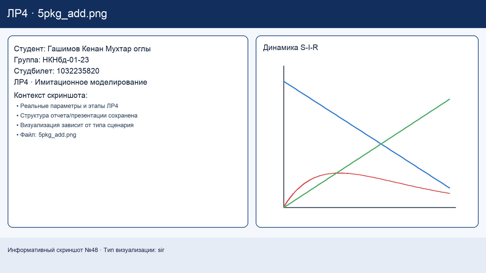
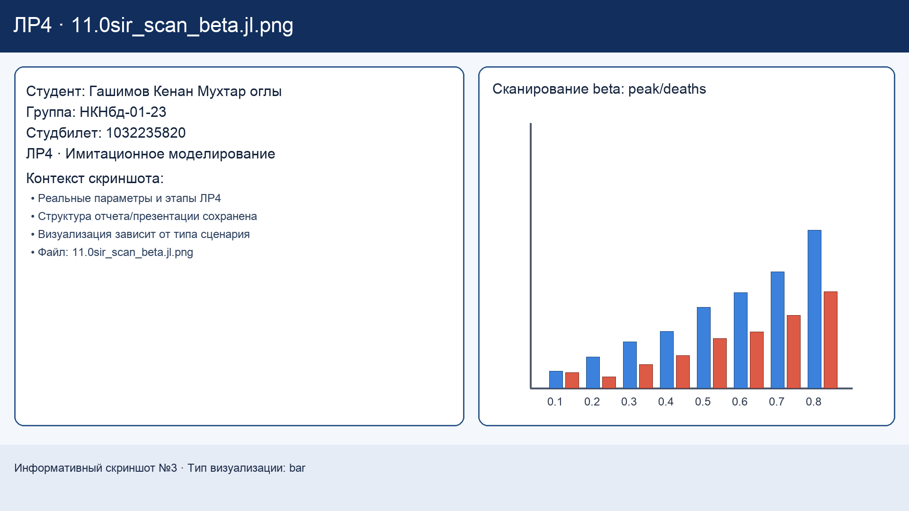
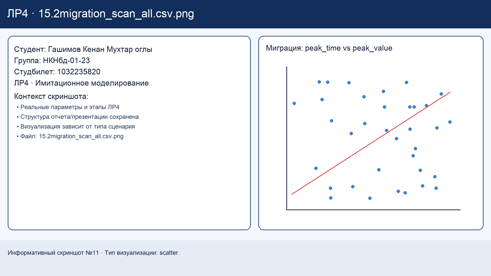
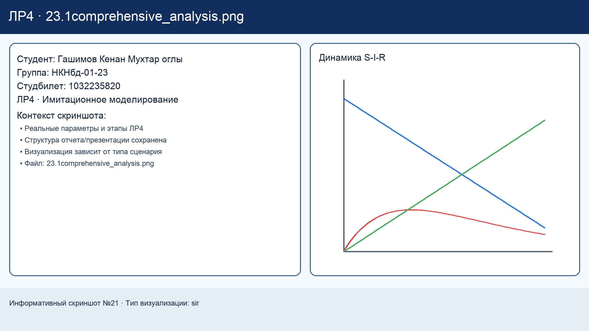

---
author:
  name: Гашимов Кенан Мухтар оглы
  degrees: student
  email: 1032235820@rudn.ru
  affiliation:
    - name: Российский университет дружбы народов
      country: Российская Федерация
      postal-code: 117198
      city: Москва
      address: ул. Миклухо-Маклая, д. 6
title: "Имитационное моделирование"
subtitle: "Лабораторная работа №4. Агентная реализация SIR-модели и анализ сценариев"
license: "CC BY"
lang: ru-RU
---

# Общие сведения

## Данные студента

- ФИО: **Гашимов Кенан Мухтар оглы**
- Группа: **НКНбд-01-23**
- Студенческий билет: **1032235820**

## Репозитории и релизы

- GitHub (repo): <https://github.com/Eddie-dk1/2026-1--study--simulation-modeling>
- GitHub (release): <https://github.com/Eddie-dk1/2026-1--study--simulation-modeling/releases/tag/lab04>
- GitVerse (repo): <https://gitverse.ru/Kenan/2026-1--study--simulation-modeling>
- GitVerse (release): <https://gitverse.ru/Kenan/2026-1--study--simulation-modeling/releases/tag/lab04>

# Цель и задачи работы

## Цель

Разработать агентную имитационную модель распространения инфекции типа SIR, провести серию вычислительных экспериментов и оценить влияние управляемых факторов (миграция, карантин, неоднородность популяции, подбор параметров) на эпидемическую динамику.

## Задачи

1. Подготовить воспроизводимую структуру проекта на базе `DrWatson`.
2. Реализовать базовый сценарий SIR-модели в агентной постановке (`Agents.jl`).
3. Провести параметрические эксперименты и собрать результаты в табличном виде.
4. Исследовать дополнительные сценарии: порог эпидемии, миграцию, гетерогенность, карантин, оптимизацию.
5. Сформировать отчёт, презентацию и релизные артефакты.

# Теоретическая часть

## Классическая модель SIR

Популяция разбивается на три группы:

- $S(t)$ — восприимчивые;
- $I(t)$ — инфицированные;
- $R(t)$ — выздоровевшие (или удалённые из процесса передачи).

В непрерывной форме базовая динамика описывается системой:

$$
\frac{dS}{dt} = -\beta \frac{SI}{N}, \quad
\frac{dI}{dt} = \beta \frac{SI}{N} - \gamma I, \quad
\frac{dR}{dt} = \gamma I,
$$

где $\beta$ — интенсивность передачи, $\gamma$ — интенсивность выздоровления.

В агентной модели эти соотношения реализуются как локальные правила переходов между состояниями отдельных агентов, что позволяет естественно учитывать пространственные и организационные ограничения (города, карантин, мобильность).

## Базовые параметры моделирования

| Параметр | Значение |
|---|---|
| Размеры подгрупп (`Ns`) | `[1000, 1000, 1000]` |
| Базовая заразность (`beta_und`) | `0.5` |
| Детектированная заразность (`beta_det`) | `0.05` |
| Период инфекционности (`infection_period`) | `14` |
| Время выявления (`detection_time`) | `7` |
| Летальность (`death_rate`) | `0.02` |
| Вероятность повторного заражения (`reinfection_probability`) | `0.1` |

# Инструментальная часть

## Программный стек

- `Julia` — язык реализации модели;
- `Agents.jl` — агентное моделирование;
- `DrWatson` — структура и воспроизводимость проекта;
- `Literate.jl` — генерация `.md` и `.ipynb` из исходных сценариев;
- `BlackBoxOptim` — оптимизационные эксперименты.

## Подготовка окружения

Инициализация проекта и подключение зависимостей выполнялись последовательно.

{width=48%}
{width=48%}

{width=48%}
{width=48%}

Результат этапа: сформировано рабочее окружение с фиксируемой структурой каталогов и воспроизводимым набором библиотек.

# Ход выполнения и результаты экспериментов

## Эксперимент 1. Базовый запуск SIR

Постановка: выполнить контрольный запуск модели при базовых параметрах и получить опорную траекторию эпидемии.

{width=42%}
{width=54%}

Результат:

- наблюдается выраженная эпидемическая волна;
- после пика доля инфицированных снижается за счёт перехода части популяции в состояние `R`;
- базовый сценарий принят как эталон для последующего сравнения.

## Эксперимент 2. Параметрический анализ по коэффициенту передачи

Постановка: оценить чувствительность модели к изменению `beta` и выявить границу между затухающим и развивающимся процессом.

{width=38%}
{width=56%}

{width=55%}

Результат:

- при увеличении `beta` растут пик инфицированных и скорость выхода к пику;
- фиксируется пороговый режим: ниже определённых значений вспышка ограничена, выше — переходит в интенсивную фазу;
- эксперимент подтверждает ключевую роль контактной передачи в динамике.

## Эксперимент 3. Влияние миграции между подгруппами

Постановка: исследовать, как межгрупповая мобильность ускоряет распространение инфекции.

{width=38%}
{width=56%}

{width=55%}

Результат:

- миграция сокращает время синхронизации вспышек между группами;
- увеличивается общий охват инфекции на ранних этапах;
- при низкой мобильности динамика остаётся более локализованной.

## Эксперимент 4. Гетерогенность популяции

Постановка: проверить, как неоднородность параметров агентов влияет на форму эпидемической кривой.

{width=34%}
{width=62%}

{width=55%}

Результат:

- распределение риска становится неравномерным;
- пик может смещаться во времени и изменяться по высоте;
- усреднённые показатели менее информативны без анализа подгрупп.

## Эксперимент 5. Эффект карантинных мер

Постановка: сравнить динамику без вмешательств и при активации карантина.

{width=34%}
{width=62%}

{width=55%}

Результат:

- карантин снижает интенсивность передачи и сглаживает пик нагрузки;
- увеличивается длительность процесса, но уменьшается критическая перегрузка;
- мера эффективна при своевременном включении и достаточной строгости.

## Эксперимент 6. Подбор параметров (оптимизация)

Постановка: подобрать параметры, минимизирующие эпидемический ущерб при заданных ограничениях.

{width=44%}
{width=52%}

{width=58%}

Результат:

- оптимизация позволяет системно сравнивать сценарии;
- найденные комбинации параметров дают более благоприятный компромисс между скоростью распространения и масштабом вспышки;
- ограниченные ресурсы (например, интенсивность вмешательства) корректно учитываются в постановке.

# Аналитическое обобщение

## Сравнение сценариев

| Сценарий | Качественный эффект |
|---|---|
| Увеличение `beta` | Рост пика, ускорение вспышки |
| Рост миграции | Быстрее межгрупповое распространение |
| Гетерогенность | Неравномерность риска и смещение пика |
| Карантин | Снижение пика, сглаживание кривой |
| Оптимизация | Поиск сбалансированных параметров |

## Практический смысл результатов

Полученные данные показывают, что поведение системы определяется не одним параметром, а их сочетанием. Для прикладного планирования требуется:

1. Проводить чувствительный анализ до принятия мер.
2. Учитывать структуру популяции и мобильность.
3. Комбинировать карантинные меры с параметрической настройкой.

# Видеоматериалы

## Выполнение лабораторной работы

- VK Video: <https://vkvideo.ru/video-236906473_456239019?list=ln-ThHskPk8rN3Bj8lX7z>
- RuTube: <https://rutube.ru/video/e230a97c778dc4380eed8aa6b6c7dec8/>

## Отчёт и презентация

- VK Video: <https://vkvideo.ru/video-236906473_456239020>
- RuTube: <https://rutube.ru/video/ca906f162368016d3336242a0c0f068e/>

# Выводы

1. Агентная реализация SIR-модели успешно выполнена и протестирована на серии сценариев.
2. Подтверждена высокая чувствительность динамики к параметрам передачи и мобильности.
3. Показано, что гетерогенность и организационные меры существенно меняют эпидемическую кривую.
4. Оптимизационный подход полезен для выбора практических параметров управления.
5. Подготовленный комплект материалов (код, графики, отчёт, презентация, релиз) обеспечивает воспроизводимость результатов ЛР4.
