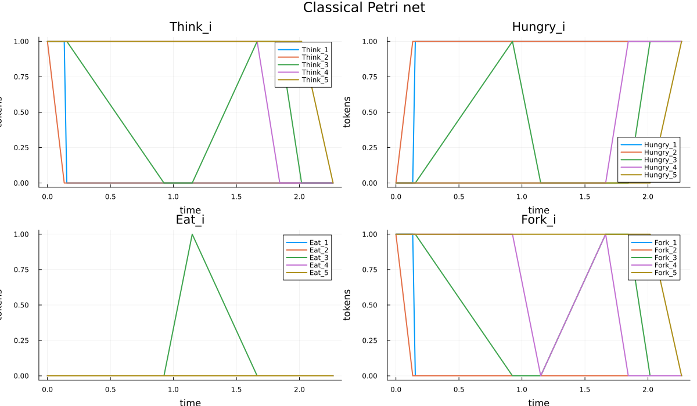
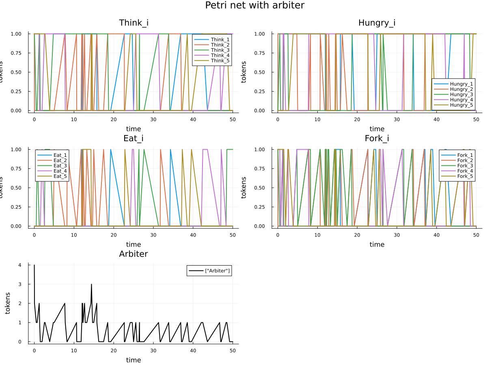
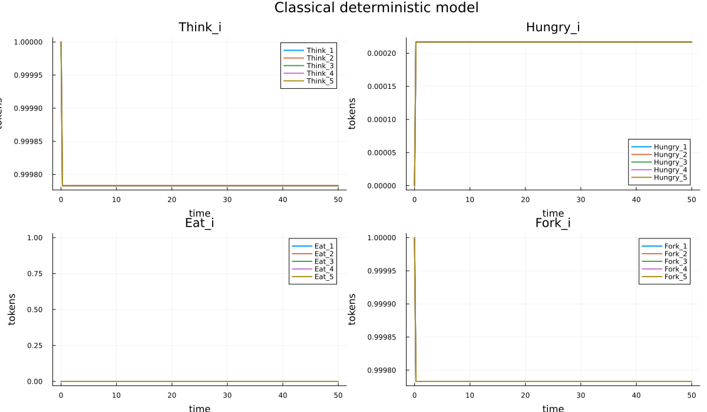
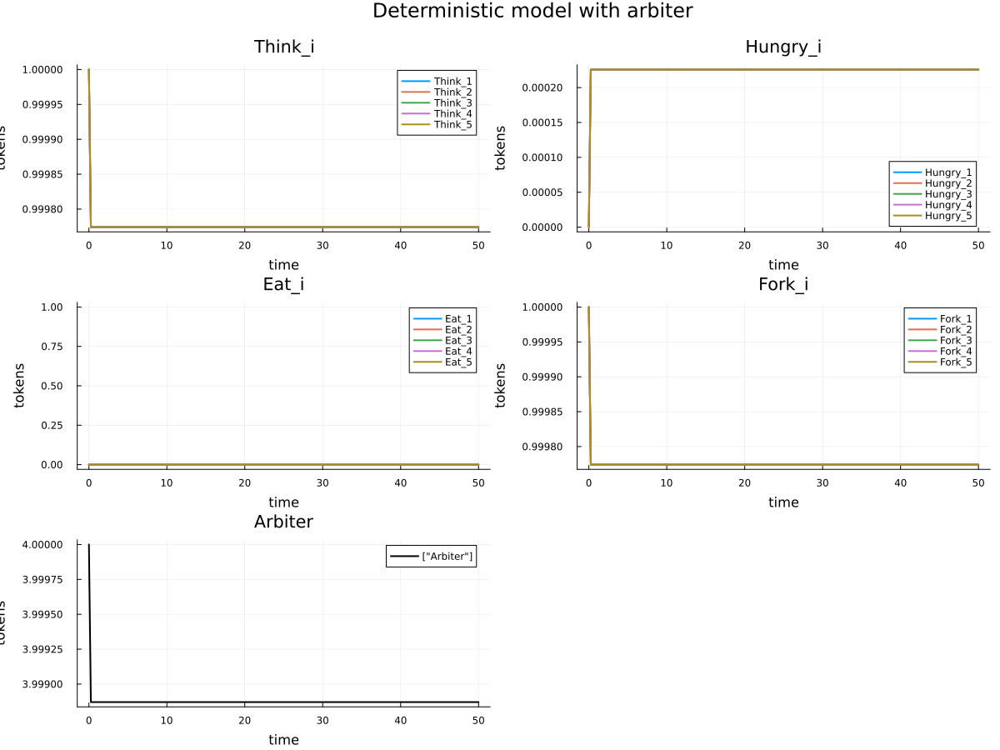
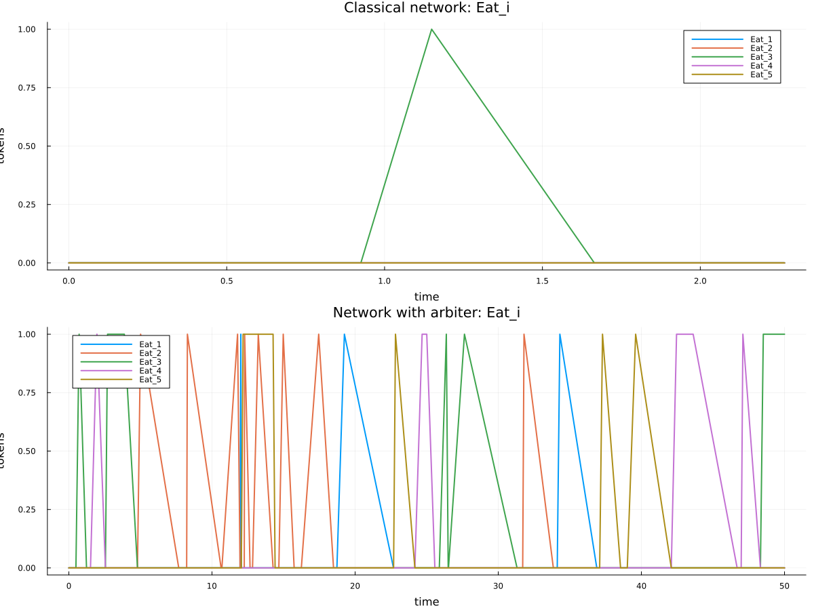
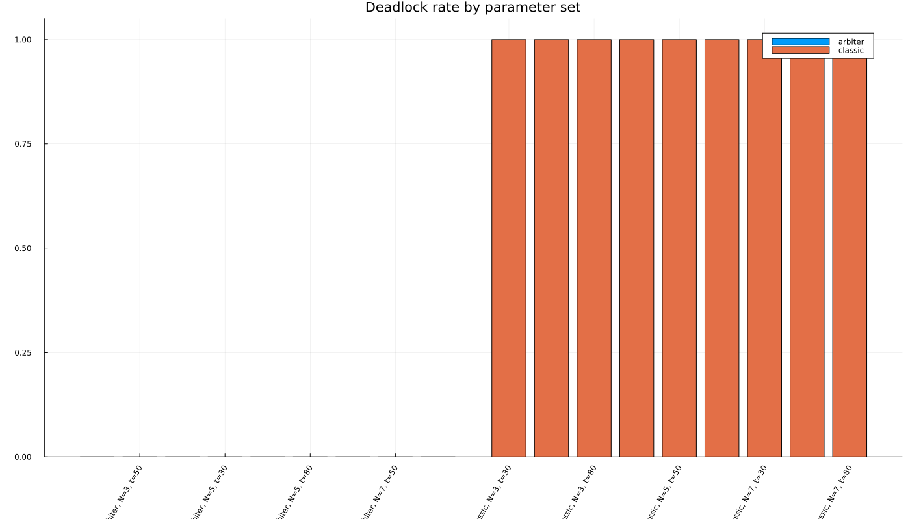

# 1. Информация

- Студент: Гашимов Кенан Мухтар оглы
- Группа: НКНбд-01-23
- Лабораторная работа №5
- Тема: аппарат сетей Петри

---

# 2. Цель и задачи

Цель работы:

- изучить сети Петри на задаче обедающих философов;
- воспроизвести `deadlock` в классической постановке;
- устранить его с помощью арбитра;
- получить графики, таблицы, анимацию и literate-артефакты.

---

# 3. Теоретическое введение

- Сеть Петри состоит из позиций, переходов, дуг и маркировки.
- Маркировка определяет текущее состояние модели.
- В задаче обедающих философов позиции описывают философов и вилки.
- В классической постановке возможен `deadlock`.
- Позиция `Arbiter` запрещает тупиковую конфигурацию.

---

# 4. Структура проекта

- `src/DiningPhilosophers.jl` — модуль модели.
- `scripts/dining_philosophers.jl` — базовый эксперимент.
- `scripts/dining_philosophers_animation.jl` — GIF-анимация.
- `scripts/dining_philosophers_report.jl` — итоговый сравнительный график.
- `scripts/dining_philosophers_params.jl` — параметрическое исследование.
- `generated/` — `clean`, `md`, `ipynb`, `qmd`.

---

# 5. Базовый эксперимент

- `N = 5`
- `tmax = 50.0`
- Рассматриваются две сети:
  - классическая;
  - с арбитром.
- Выполнены стохастическое и детерминированное моделирование.

---

# 6. Классическая сеть

---

# 7. Вывод по классической сети

- `deadlock = true`
- число состояний: `9`
- итоговое число голодных философов: `5`
- итоговое число философов в состоянии `Eat`: `0`
- тупиковая маркировка достигнута при `t ≈ 2.27`

---

# 8. Сеть с арбитром

---

# 9. Вывод по сети с арбитром

- `deadlock = false`
- число состояний: `76`
- в конце моделирования сохраняется активность
- хотя бы один философ остаётся в состоянии `Eat`
- `Arbiter` ограничивает число одновременных попыток захвата вилок

---

# 10. Детерминированная модель

---

# 11. Детерминированная модель с арбитром

---

# 12. Итоговый сравнительный график

---

# 13. Интерпретация итогового графика

- В классической сети все `Eat_i` быстро исчезают.
- После этого сеть остаётся в тупиковом состоянии.
- В сети с арбитром состояния `Eat_i` продолжают появляться.
- Следовательно, сеть с арбитром сохраняет живость.

---

# 14. Анимация процесса

- Построен GIF `plots/philosophers_simulation.gif`.
- Каждый кадр показывает маркировку сети во времени.
- Анимация иллюстрирует перераспределение фишек между состояниями.

---

# 15. Параметрическое исследование

- Перебраны:
  - `N = 3, 5, 7`
  - `tmax = 30, 50, 80`
  - `seed = 123, 124, 125`
- Выполнено `54` прогона.

---

# 16. График параметрического исследования

---

# 17. Результаты параметрического исследования

- `classic`: `27 / 27` запусков завершились `deadlock`
- `arbiter`: `0 / 27` запусков завершились `deadlock`
- для классической сети `final_eat = 0` во всех сериях
- для сети с арбитром в конце часто остаётся хотя бы один философ в `Eat`

---

# 18. Literate-артефакты

Сгенерированы:

- `clean`-версии скриптов;
- Markdown-документы;
- Jupyter notebooks;
- Quarto-документы (`qmd`).

Каталог: `generated/`.

---

# 19. Основные полученные файлы

- `data/dining_classic.csv`
- `data/dining_arbiter.csv`
- `data/dining_params.csv`
- `plots/classic_simulation.png`
- `plots/arbiter_simulation.png`
- `plots/final_report.png`
- `plots/dining_params.png`
- `plots/philosophers_simulation.gif`

---

# 20. Выводы

- Построена сеть Петри для задачи обедающих философов.
- В классической сети подтверждено возникновение `deadlock`.
- Введение арбитра устраняет тупиковую конфигурацию.
- Получены графики, CSV-таблицы, GIF и literate-представления.
- Параметрический анализ подтвердил устойчивость результата.
