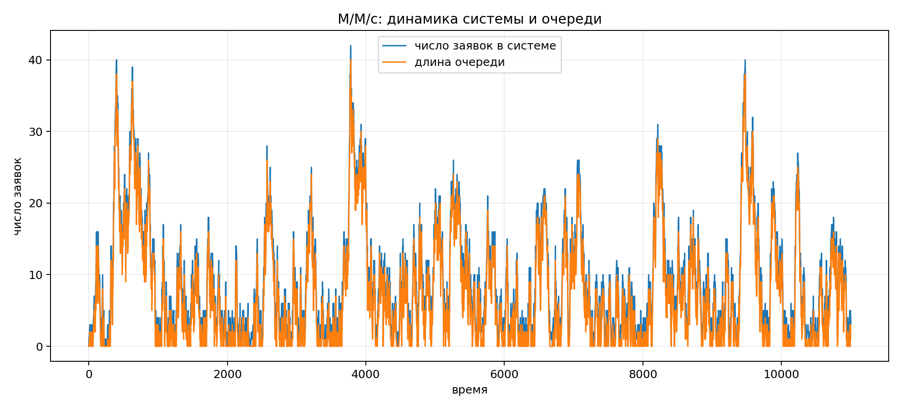
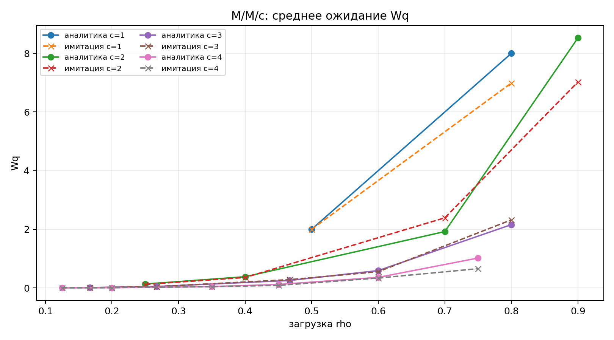
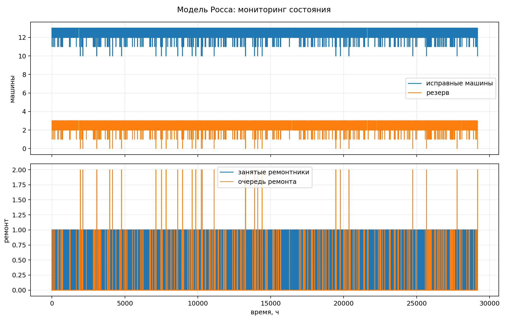
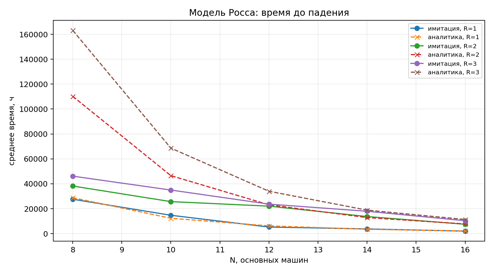
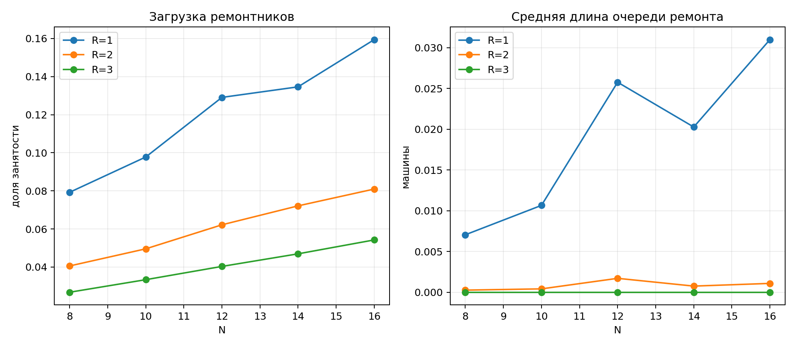

# Цель

- реализовать модель `M/M/c`;
- реализовать модель Росса с резервом и ремонтом;
- добавить графики, мониторинг и аналитику;
- подготовить literate-артефакты, отчёт и презентацию.

---

# Структура

- `src/SimulationModelingLab07.jl`;
- `scripts/*_literate.jl`;
- `generated/clean`, `md`, `notebooks`, `qmd`;
- `data/`, `plots/`;
- `report/`, `presentation/`, `deliverables/`.

---

# M/M/c

- `lambda = 0.9`, `mu = 0.5`, `c = 2`;
- загрузка `rho = 0.900`;
- аналитическое `Wq = 8.526`;
- имитационное `Wq = 7.905`.

---

# Параметры M/M/c

---

# Модель Росса

- `N = 10`, `S = 3`;
- несколько ремонтников поддержаны параметром `repairers`;
- базовая серия: среднее время до падения `11718.3` ч;
- аналитика: `12340.0` ч.

---

# Параметрический прогон

---

# Очередь ремонта

---

# Итоги

- `M/M/c` согласуется с формулами Эрланга C;
- для Росса построено аналитическое решение;
- добавлены несколько ремонтников и прогоны по `N`;
- сформированы Markdown, DOCX, PDF, HTML, notebook и Quarto-артефакты.
