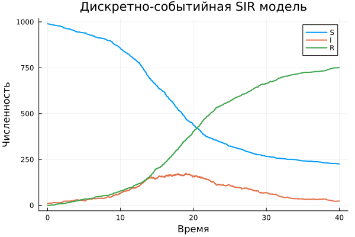
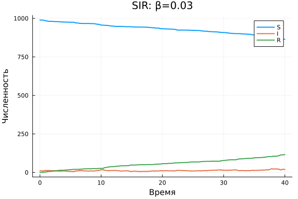
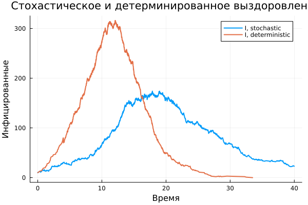
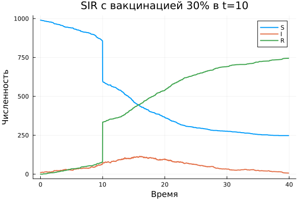
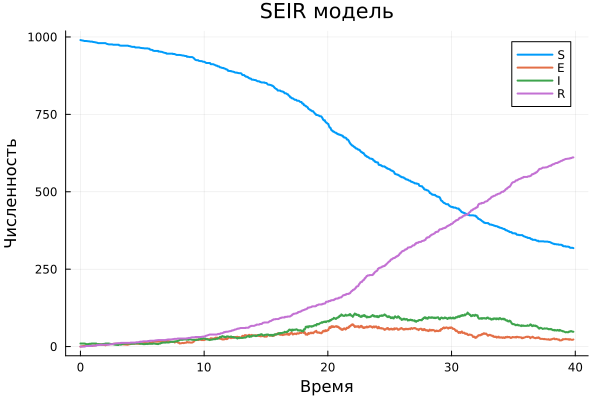

---
author:
  name: "ФИО СТУДЕНТА"
  affiliation:
    - name: "Российский университет дружбы народов имени Патриса Лумумбы"
      country: "Российская Федерация"
      city: "Москва"
title: "Лабораторная работа 8"
subtitle: "Дискретно-событийная SIR модель"
license: "CC BY"
date: today
date-format: "YYYY-MM-DD"
---

# Информация

## Докладчик

:::::::::::::: {.columns align=center}
::: {.column width="65%"}

- ФИО СТУДЕНТА
- Группа: УКАЗАТЬ ГРУППУ
- Направление: 02.03.01 Математика и компьютерные науки
- Организация: РУДН имени Патриса Лумумбы
- Преподаватель: УКАЗАТЬ ФИО И ДОЛЖНОСТЬ

:::
::: {.column width="35%"}

:::
::::::::::::::

# Вводная часть

## Актуальность

- Дискретно-событийные модели позволяют описывать случайные события в виртуальном времени.
- Эпидемические модели удобны для анализа влияния параметров и сценариев вмешательства.
- Julia и `ConcurrentSim.jl` позволяют реализовать агентную модель в воспроизводимом виде.

## Объект и предмет

- Объект исследования: распространение инфекции в смешивающейся популяции.
- Предмет исследования: дискретно-событийная реализация SIR и её модификации.
- Рассматриваются базовая SIR, параметрические прогоны, вакцинация, демография и SEIR.

## Цель и задачи

- Цель: реализовать и исследовать дискретно-событийную SIR модель.
- Реализовать ядро модели и скрипты запуска.
- Провести анализ влияния `β`, `c`, `γ`.
- Сравнить стохастическое и детерминированное выздоровление.
- Подготовить отчёт, презентацию, notebook и Quarto-документацию.

## Материалы и методы

- Язык: Julia.
- Моделирование: `ConcurrentSim.jl`, `ResumableFunctions.jl`.
- Данные и графики: `DataFrames.jl`, `CSV.jl`, `StatsPlots.jl`.
- Воспроизводимость: `DrWatson.jl`, `Literate.jl`, Quarto.

# Реализация

## Структура модели

- `SIRPerson`: идентификатор и статус агента.
- `SIRModel`: параметры, симулятор, временные ряды и список агентов.
- `live`: жизненный цикл агента с ожиданием контакта и выздоровления.
- `out`: экспорт временных рядов в `DataFrame`.

## Алгоритм

1. Создать популяцию с начальными состояниями `S`, `I`, `R`.
2. Запустить процесс для каждого агента.
3. Обрабатывать события заражения и выздоровления.
4. Сохранять временные ряды в момент каждого события.
5. Построить графики и сохранить CSV.

# Результаты

## Базовый эксперимент

{width=85%}

## Анализ параметров

{width=70%}

## Сравнение выздоровления

{width=85%}

## Вакцинация

{width=85%}

## SEIR

{width=85%}

# Заключение

## Выводы

- Реализована дискретно-событийная SIR модель на Julia.
- Получены графики и CSV для базового и параметрических запусков.
- Показано влияние `β`, `c`, `γ` на пик и длительность эпидемии.
- Добавлены модификации: фиксированное выздоровление, вакцинация, демография, SEIR.
- Подготовлен воспроизводимый комплект отчётности из Markdown/Quarto.
