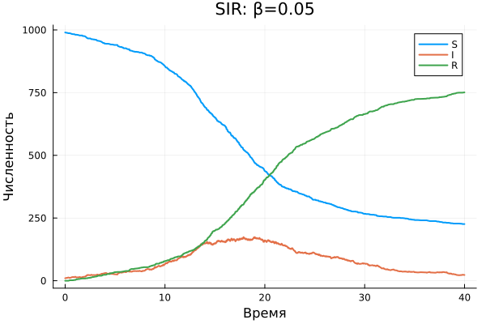
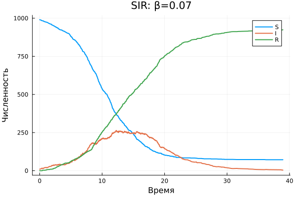
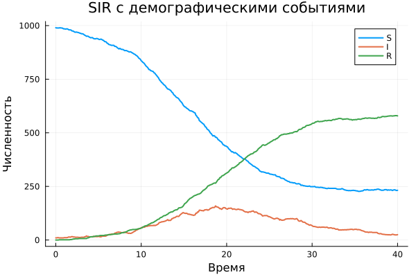

---
author:
  name: "ФИО СТУДЕНТА"
  affiliation:
    - name: "Российский университет дружбы народов имени Патриса Лумумбы"
      country: "Российская Федерация"
      city: "Москва"
title: "Лабораторная работа 8"
subtitle: "Реализация основных моделей в дискретно-событийном подходе"
license: "CC BY"
---

# Цель работы

Изучить дискретно-событийный подход к имитационному моделированию на примере классической модели распространения инфекции SIR. Реализовать стохастическую дискретно-событийную модель на языке Julia, выполнить анализ параметров, сравнить варианты модели и подготовить воспроизводимый комплект результатов.

# Задание

В работе требуется создать рабочий каталог, установить необходимые пакеты, выполнить предложенный код, преобразовать его в литературный стиль, сгенерировать чистый код, Jupyter notebook и документацию Quarto, выполнить notebook, интегрировать документацию в отчёт, добавить вычисления для набора параметров и повторить генерацию артефактов.

# Теоретическое введение

Дискретно-событийная имитационная модель описывает систему через события, которые происходят в отдельные моменты виртуального времени. В модели SIR каждый агент находится в одном из трёх состояний: восприимчивый `S`, инфицированный `I` или переболевший `R`. События заражения и выздоровления изменяют состояние агента и обновляют временные ряды численности групп.

В работе используются пакеты `ConcurrentSim.jl`, `ResumableFunctions.jl`, `Distributions.jl`, `DataFrames.jl`, `StatsPlots.jl`, `CSV.jl`, `BenchmarkTools.jl`, `DrWatson.jl` и `Literate.jl` [@concurrentsim; @literatejl]. Документация и производные форматы отчёта/презентации собираются через Quarto [@quarto].

# Выполнение лабораторной работы

## Структура проекта

Основная реализация находится в `src/sir_model.jl`, сценарии запусков находятся в `scripts/`, литературный код находится в `literate/`, сгенерированные notebook и документация находятся в `notebooks/` и `docs/`. Результаты моделирования сохраняются в `data/sims/`, графики сохраняются в `plots/`.

## Базовая SIR модель

Модель создаётся функцией `MakeSIRModel(u0, p)`, где `u0=[S0,I0,R0]`, а `p=[β,c,γ]`. Процессы агентов запускаются функцией `activate`, симуляция выполняется функцией `sir_run`, результаты собираются функцией `out`.

Базовый эксперимент выполнен с параметрами, приведёнными в [табл. @tbl-base-params].

| Параметр | Значение | Смысл |
|---|---:|---|
| `tmax` | 40.0 | длительность моделирования |
| `S0` | 990 | начальное число восприимчивых |
| `I0` | 10 | начальное число инфицированных |
| `R0` | 0 | начальное число переболевших |
| `β` | 0.05 | вероятность заражения при контакте |
| `c` | 10.0 | частота контактов |
| `γ` | 0.25 | интенсивность выздоровления |

: Параметры базового эксперимента {#tbl-base-params}

На [рис. @fig-sir-des] показана динамика базовой дискретно-событийной модели.

{#fig-sir-des width=90%}

## Анализ чувствительности

Для анализа чувствительности выполнены серии запусков по параметрам `β`, `c` и `γ`. Увеличение `β` и `c` усиливает распространение инфекции, повышает пик инфицированных и ускоряет его наступление. Увеличение `γ` сокращает среднее время болезни, поэтому пик инфекции уменьшается, а эпидемическая волна затухает быстрее.

Пример влияния вероятности заражения показан на [рис. @fig-beta-003], [рис. @fig-beta-005] и [рис. @fig-beta-007].

{#fig-beta-003 width=80%}

{#fig-beta-005 width=80%}

{#fig-beta-007 width=80%}

## Детерминированная длительность болезни

В стохастической версии время выздоровления распределено экспоненциально. В модифицированной версии оно заменено фиксированной величиной `1/γ`. Сравнение числа инфицированных приведено на [рис. @fig-recovery-compare].

{#fig-recovery-compare width=90%}

## Вакцинация, демография и SEIR

Событие вакцинации переводит заданную долю восприимчивых индивидов в состояние `R` в фиксированный момент времени. Результат вакцинации 30% восприимчивых в момент `t=10` показан на [рис. @fig-vaccination].

{#fig-vaccination width=90%}

Демографическая модификация учитывает рождения и смерти, что позволяет получить модель с изменяющейся численностью популяции. Результат показан на [рис. @fig-demographic].

{#fig-demographic width=90%}

В модели SEIR добавлено латентное состояние `E`. После заражения индивид сначала переходит в `E`, затем становится инфекционным `I`, а после выздоровления переходит в `R`. Результат приведён на [рис. @fig-seir].

{#fig-seir width=90%}

## Производительность

Для оценки производительности используется `BenchmarkTools.@benchmark` на популяции 10000 индивидов. Результат сохраняется в `data/sims/benchmark.txt`. Возможные направления оптимизации: хранить списки индивидов по состояниям, предварительно генерировать случайные величины, уменьшать число обращений к полному массиву агентов при выборе контакта.

## Литературный код

Файлы `literate/sir_literate.jl` и `literate/sir_parameters.jl` являются источниками, из которых генерируются чистые Julia-скрипты, Jupyter notebooks и Markdown/Quarto-документация. Это обеспечивает воспроизводимость: один источник используется для кода, notebook и документации.

# Выводы

В ходе работы реализована дискретно-событийная стохастическая SIR модель на Julia, выполнен базовый прогон, сохранены графики и CSV-файлы, проведён анализ чувствительности параметров, добавлены модификации с детерминированным выздоровлением, вакцинацией, демографическими событиями и латентным периодом SEIR. Подготовлены литературные исходники, notebook, Quarto-документация, отчёт и презентация.

# Список литературы{.unnumbered}

::: {#refs}
:::
